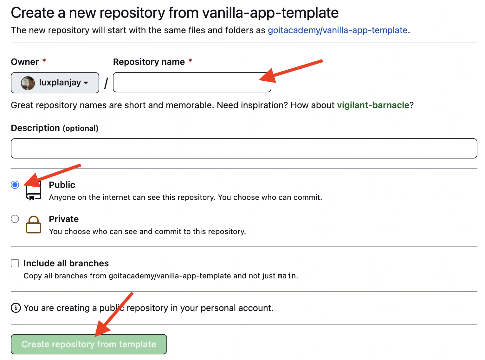

# Vanilla App Template

This project was created using Vite. For familiarization and configuration of
additional features [refer to the documentation](https://vitejs.dev/).

## Creating a repository from a template

Use this GoIT organization repository as a template to create your own project
repository. To do this, click the `«Use this template»` button and select the
`«Create a new repository»` option, as shown in the image.


In the next step, the page for creating a new repository will open. Fill in the
name field, make sure the repository is public, and then click the
`«Create repository from template»` button.



After the repository is created, you need to go to the settings of the created
repository on the `Settings` > `Actions` > `General` tab as shown in the image.


Scroll to the very bottom of the page, in the `«Workflow permissions»` section,
select the `«Read and write permissions»` option and check the checkbox. This is
necessary to automate the project deployment process.


Now you have your personal project repository, with the file and folder
structure of the template repository. Next, work with it like any other personal
repository: clone it to your computer, write code, make commits, and push them
to GitHub.

## Getting ready to work

1. Make sure that the LTS version of Node.js is installed on your computer.
   [Download and install](https://nodejs.org/en/) it if necessary.
2. Install the basic project dependencies in the terminal with the command
   `npm install`.
3. Start the development mode by running the command `npm run dev` in the
   terminal.
4. Navigate in the browser to [http://localhost:5173](http://localhost:5173).
   This page will automatically reload after saving changes to the project
   files.

## Files and folders

- Component markup files for the page should be placed in the `src/partials`
  folder and imported into the `index.html` file. For example, the header markup
  file `header.html` is created in the `partials` folder and imported into
  `index.html`.
- Style files should be placed in the `src/css` folder and imported into the
  HTML files of the pages. For example, for `index.html` the style file is
  called `index.css`.
- Add images to the `src/img` folder. The builder will optimize them, but only
  when deploying the production version of the project. All this happens in the
  cloud to avoid loading your computer, because on weak computers it can take a
  long time.

## Deployment

The production version of the project will be automatically built and deployed
to GitHub Pages, into the `gh-pages` branch, each time the `main` branch is
updated. For example, after a direct push or an accepted pull request. To do
this, you need to change the value of the `--base=/<REPO>/` flag in the
`package.json` file for the `build` command, replacing `<REPO>` with the name of
your repository, and push the changes to GitHub.

```json
"build": "vite build --base=/<REPO>/",
```

Next, you need to go to the GitHub repository settings (`Settings` > `Pages`)
and set the production version file distribution from the `/root` folder of the
`gh-pages` branch, if it was not done automatically.


### Deployment status

The deployment status of the latest commit is indicated by an icon next to its
identifier.

- **Yellow color** – the project build and deployment are in progress.
- **Green color** – deployment completed successfully.
- **Red color** – an error occurred during linting, building, or deployment.

More detailed information about the status can be viewed by clicking on the
icon, and in the drop-down window, follow the `Details` link.


### Live page

After some time, usually a few minutes, the live page will be available at the
address specified in the `Settings` > `Pages` tab in the repository settings.
For example, here is a link to the live version for this repository

[https://goitacademy.github.io/vanilla-app-template/](https://goitacademy.github.io/vanilla-app-template/).

If a blank page opens, make sure there are no errors in the `Console` tab
related to incorrect paths to the project's CSS and JS files (**404**). Most
likely you have an incorrect value for the `--base` flag for the `build` command
in the `package.json` file.

## How it works


1. After each push to the `main` branch of the GitHub repository, a special
   script (GitHub Action) from the `.github/workflows/deploy.yml` file is
   launched.
2. All repository files are copied to the server, where the project is
   initialized and goes through linting and building before deployment.
3. If all steps are successful, the built production version of the project
   files is sent to the `gh-pages` branch. Otherwise, the execution log will
   indicate what the problem is.
